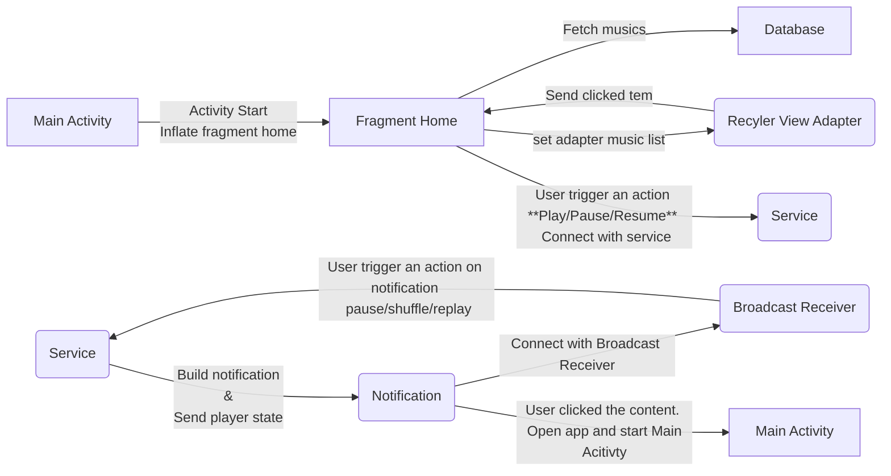

# Mussic -On Progress

Mussic is a music player app built on MVVM android architecture.
Mussic can play the songs that are on your device or songs on youtube

- [x] Database were built
- [x] Android service was added
- [x] Music player was added
- [x] BroadCast Receiver added
- [x] Notification added
- [x] Trigger action on notification
- [x] Share music on another app
- [ ] Play songs on youtube was successfully done
- [ ] Playlist create/delete/add music to playlist

## Getting Started
Since the app was developed in Kotlin, some changes have been made to use the android library
- On gradle.properties fields you must add
```
kapt.incremental.apt=true
```
- On app gradle file when import android room

> ~~annotationProcessor~~ "android.arch.persistence.room:compiler:$room_version"

> kapt "android.arch.persistence.room:compiler:$room_version"

To get more info
> [Annotation Processor](https://medium.com/@robhor/annotation-processing-for-android-b7eda1a41051)
> [Kapt](https://kotlinlang.org/docs/reference/kapt.html)

#### Mussic flow chart


#### Architecture
Built on MVVM
> Model + View + ViewModel

> ```mermaid
> graph LR
> Activity/Fragments --> ViewModel[ViewModel - with Livedata-]
> ViewModel --> Repository
> Repository --> Database
> ```

- [Android Room Library](https://developer.android.com/jetpack/androidx/releases/room)
- [ViewModel](https://developer.android.com/topic/libraries/architecture/viewmodel)
- [Livedata](https://developer.android.com/topic/libraries/architecture/livedata)
- [Observable](https://developer.android.com/reference/java/util/Observable)
- [BroadCast Receiver](https://android.jlelse.eu/broadcast-receivers-for-beginners-a9d7aa03fb76)
- [Service](https://developer.android.com/reference/android/app/Service.html)


###### Licence
[MIT](https://choosealicense.com/licenses/mit/)

